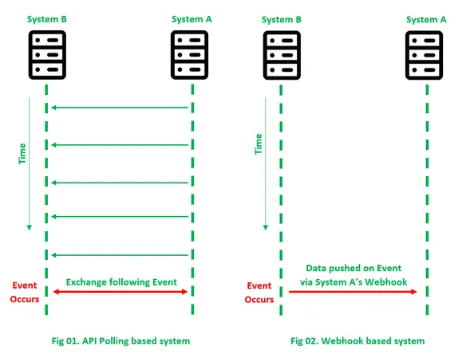

# Основные темы семинара
## Популярные способы сетевого взаимодействия
* **HTTP Polling (Short and Long)**
* **WebHooks**
* **Server-Sent-Events (SSEs)**
* WebSockets
* gRPC

# Short polling
Периодическая отправка запросов на сервер с фиксированным интервалом времени.

#### Плюсы
* Прост в разработке
* Работает на всех платформах

<h4>Минусы</h4>

* Создает большой сетевой трафик.
* Слабо применим для данных в реальном времени. Может создать задержки в зависимости от интервала.
* Нагрузка на сервер, соответственно сложность масштабирования.

#### Когда использовать
В моментах, когда происходят частые обновления и они точно будут на следующем запросе.

# Long polling
Периодическая отправка запросов на сервер с фиксированным интервалом времени. 
При этом сервер держит соединение до тех пор, пока не получит обновления.

#### Плюсы
* Обновления приходят в реальном времени с минимальной задержкой.
* Меньше сетевого трафика т.к. соединение открыто дольше чем при short polling.

<h4>Минусы</h4>

* Нагрузка на сервер выше, т.к. соединение открыто
* Сложнее в реализации

#### Когда использовать
Когда обновления не такие частые, например при пушах или в чатах. Если обновления частые, 
способ по нагрузке приближается к short polling.

# SSE
Длительное соединение при котором сервер отправляет клиенту данные по мере появления.

#### Плюсы
* Отлично подходит сценариям, где нужно получать много обновлений в определенный период.

<h4>Минусы</h4>

* Данные могу передаваться только **от сервера к клиенту**
* Кол-во соединений ограничено в браузере.

#### Когда использовать
При частых, постоянных обновлениях, например при обновлениях цены акций или данных спортивных игр.

# Webhooks
HTTP запрос, который отправляется на заданные endpoint как реакция на определенное событие.

#### Плюсы
* Обновления в реальном времени без polling.
* За счет использования http позволяет отправлять любые данные в payload.

<h4>Минусы</h4>

* Получателю и отправителю нужно договориться, настроить и поддерживать endpoint.
* Получатель должен открыть endpoint в сети, возникает вопрос безопасности.

#### Когда использовать
При отправке уведомлений получателю. Обычно используется в межсерверном взаимодействии.

# ДЗ
Спроектировать и реализовать сервис для алгоритмического трейдинга с возможностью подключения ботов. 
Сервис "биржа" должен получать информацию о цене активов с разных "источников" и давать возможность ботам 
делать операции по покупке и продаже. Сделать двух ботов, один должен выкупать активы при их просадке, 
второй наоборот продавать. Покупкой и продажей должны являться методы на "бирже", которые выводят информацию за какую цену и кто продал актив.

### Спроектировать сервисы в любом редакторе (2)
* Достаточно будет диаграммы взаимодействия компонент. В репозиторий залить _.png_ файл с диаграммой.
### Разработать "биржу" (3)
* Биржа агрегирует данные от источников и позволяет клиентам получать актуальную цену того или иного актива.
* Биржа должна давать возможность покупать или продавать тот, или иной актив и выводить информацию о транзакциях.
* Для упрощения работы биржи, будем считать что цена полностью зависит от источника.
### Разработать источники (1)
* Источник показывает цену актива. 
* Один источник, один актив.
* Достаточно сделать 3 источника.
### Разработать ботов (3)
* Бот должен получать информацию от биржи и на основе исторических данных решать, покупать или продавать актив.
* Сделать двух ботов: 
  * Первый(инвестор) выкупает падающий актив и потом при росте продает. В остальных случаях держит.
  * Второй(хомяк) выкупает дешевле, чем покупал раньше, при росте держит, при резком падении продает актив.
* Каждый бот может следить за несколькими активами
### Написать тесты для биржи и ботов (1)
* Достаточно сделать интеграционные тесты с моками для каждого сервиса отдельно.

#### Рекомендации
* Python 3.9
* Придерживаться правил чистой архитектуры
* Логирование
* Основным фреймворком считать FastAPI
* Для сервера SSE лучше использовать библиотеку _sse-starlette_, для клиента использовать _sseclient_
* Добавить readme по установке зависимостей и запуску
* Для упрощения работы с зависимостями используйте _requirements.txt_
